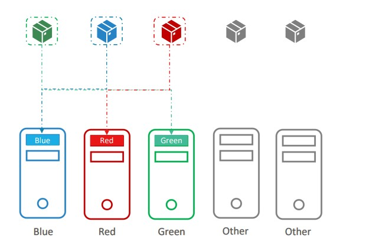

# Manual scheduling
Manual scheduling happens when you want to specify on which exact node a POD must be scheduled. Each POD definition has a property names _nodeName_ which is by default empty. 
To manually assign a POD to a specify node all you have to do is assign this property to the node name. T
```
pod-definition.yaml
-------------------
apiVersion: v1
kind: Pod
metadata: 
    name: nginx-pod
    labels: 
        app: nginx
spec:
    containers:
    - name: nginx-container
      image: nginx:latest
    nodeName: mynode1
```
Note that you can only specify the nodeName property at _creation time_, therefore if you want to manually schedule an already existing POD, a POST request to the **POD binding** API must be performed using as body the JSON version of the following definition:
```
pod-binding-definition.yaml
-------------------
apiVersion: v1 
kind: Binding
metadata:
    name: nginx
target:
    apiVersion: v1
    kind: Node
    name: mynode1
```
To te following API:
```
http://<api_server>/api/v1/namespaces/default/pods/<pod_name>/binding/
```

# Labels and selectors
Labels allows us to identify a given resource with a given property, while selectors help us to filter resources based on labels' values.
In the same way, in Kubernetes it is possible to group resources using labels and selectors.
We can label a pod using the label property in the definition file. In the following example, the label app is assigned to nginx in the nginx POD.
```
pod-definition.yaml
-------------------
apiVersion: v1
kind: Pod
metadata: 
    name: nginx-pod
    labels: 
        app: nginx
spec:
    containers:
    - name: nginx-container
      image: nginx:latest
    nodeName: mynode1
```
Notice that when dealing with replicasets, labels can be defined in two places:
- Defined in the **template** section are the label configured on the PODs
- Defined in the **replicaset metadata** section are the ones related to the replicaset itself.

In particular, the replicaset selects the PODs included in the set by matching the labels created on the PODs (template section) with the labels specified in the selector property. See the example below for details:
```
replicaset.yaml
-------------------
apiVersion: apps/v1
kind: ReplicationSet
metadata: 
    name: nginx-rs
    labels: 
        app: nginx # Replicaset label
spec:
    replicas: 3   
    selector:
        matchLabels:
            app: nginx # Replicaset includes all PODs having this label
    template:    
        metadata: 
            name: nginx-pod
            labels: 
                app: nginx # POD label
        spec:
            containers:
            - name: nginx-container
            image: nginx:latest
```
It works the same for other objects like services or deployments.

To simply label a kubernetes object, use the following command:
```
kubectl label <object> <name> key=value
```
For instance to label the node `node01` with label `color=blue`:
```
kubectl label node node01 color=blue
```
# Annotations
Annotations are used to record some information about the Kubernetes object, like build version, deploy version, etc.
```
pod-definition.yaml
-------------------
apiVersion: v1
kind: Pod
metadata: 
    name: nginx-pod
    labels: 
        app: nginx
    annotations:
        buildVersion: 1.1
spec:
    containers:
    - name: nginx-container
      image: nginx:latest
    nodeName: mynode1
```

To get all pods having a given label, just run the following:
```
kubectl get pods -l "label=value"
```
or using the selector flag
```
kubectl get pods --selector label=value
```

# Taints and tolerations
The concepts of taints and tolerations allows us to define which pods can be scheduled on which nodes.

By default, none of the PODs can tolerate any taint. This means that if we put a **taint** on a node (let's say, `app=myapp`), no pods with the default configuration will be scheduled on that node.
To enable some PODs to be scheduled on a tainted nade, we add a **toleration** to the PODs, so that PODs became _tolerant to particular taints_. In this way, tolerant PODs will be scheduled on tainted nodes.

A taint can be set on a node using the following command:
```
kubectl taint nodes node-name key=value:taint-effect
```
There are three taint effects:
- **NoSchedule**: The scheduler will not schedule any non-tolerant POD on the given node.
- **PreferNoSchedule**: The scheduler will try to not schedule any non-tolerant POD on the given node (it is not guaranteed).
- **NoExecute**: New PODs will not be scheduled on that PODs, and existing PODs on that node will be _evicted_ if they do not implement the corresponding toleration.

For instance,
```
kubectl taint nodes node1 app=myapp:NoSchedule
```

Toleration can be instead added to PODs using the YAML manifests:
```
pod-definition.yaml
-------------------
apiVersion: v1
kind: Pod
metadata: 
    name: nginx-pod
    labels: 
        app: nginx
spec:
    containers:
    - name: nginx-container
      image: nginx:latest
    tolerations:
    - key: "app"
      operator: "Equal"
      value: "myapp"
      effect: "NoSchedule"
```

Remember that taints and tolerations **do not ensure** that **a particular POD will be placed in a particular node**, but they just allows you to specify if a given POD can or cannot be scheduled on a given node.

## Taints and master nodes
When a Kubernetes cluster is created, a taint on the master node is _automatically set_ to specify no POD (except from system PODs) can be scheduled on the master nodes.
The taint can be seen by running:
```
kubectl describe node <master_node> | grep Taint
---------
Taints:     node-role.kubernetes.io/master:NoSchedule
```
This is a best practice and should not be changed.

# Node selectors and Node affinity
If in your Kubernetes setup you have nodes with different sizes, it could be useful to specify which POD should be on which node to ensure that a given node doesn't go out of resource limits in case a demanding application is scheduled on that node.
There are two ways to accomplish this task:
- **Node selector**
- **Node affinity**
## Node selectors
Specify the node selector in the corresponding property. This property is based on _labels_ to identify the node where the pod will be scheduled. For instance, in the following example the POD will be scheduled on nodes having the `size=large` label.

```
pod-definition.yaml
-------------------
apiVersion: v1
kind: Pod
metadata: 
    name: nginx-pod
    labels: 
        app: nginx
spec:
    containers:
    - name: nginx-container
      image: nginx:latest
    nodeSelector: 
        size: large
```
# Node affinity
If the scheduling requirements are more complex (for instance, schedule a POD on medium or large nodes), then we need node affinity. For instance:

```
pod-definition.yaml
-------------------
apiVersion: v1
kind: Pod
metadata: 
    name: nginx-pod
    labels: 
        app: nginx
spec:
    containers:
    - name: nginx-container
      image: nginx:latest
    affinity: 
        nodeAffinity:
          requiredDuringSchedulingIgnoredDuringExecution: 
            nodeSelectorTerms:
            - matchExpressions:
              - key: size
                operator: In
                values:
                - large
```
Notice that this is much more complex but allows us to specify more complex criteria for node selection.

One of the possibilities node affinity gives us, is the fact to specify where the node affinity filter should be evaluated:
- _DuringScheduling_: means that the rule will be evaluated only if a POD does not exists and is then created. This means that if a POD exists, and the nodeAffinity property is changed at runtime, the rule will not be evaluated until the POD is rescheduled (deleted and recreated).
- _DuringExecution_: means that the rule will always be evaluated. So the POD of the previous example will be evicted and rescheduled on the node satisfying the affinity rule.

# Node taints vs Node affinity
To dedicate nodes to specific PODs, the way to go is to use a combination of taints/tolerations and node affinity.
Suppose we want to schedule only red pods on red nodes, blue pods on blue nodes and green pods on green nodes.
- If we just use taints and tolerations, then it is not ensured that a red pod will be scheduled on a red node, because no red pod can be scheduled on the red node, but a red pod can also be scheduled on a non-tainted node.
- If we just use affinity, then it is not guaranteed that a pod without any label will not be scheduled on a red node.

Therefore, using a combination of the two, we can taint each node with its color and assign to each pod a label with its own color. Then, we set node affinity on each pod to specify that a given pod can be only scheduled on a node having a given label.


# Resources requests and limits
Whenever a POD is scheduled on a node, it consumes the resources of that specific node. The scheduler decides in which node a POD should go based on the fact that the node has sufficient resources to host the node. If any node has enough resources, then Kubernetes will not schedule the POD, writing in the events _"Insufficient CPU"_. 

## Resources requests
By default, to schedule a POD, Kubernetes requests for each container in the POD a minimum of **0.5 CPUs** and **256Mi of memory**. When the scheduler schedules the POD on a node, uses these values to decide if the node has enough resources. 
These values can be customized:
```
pod-definition.yaml
-------------------
apiVersion: v1
kind: Pod
metadata: 
    name: nginx-pod
    labels: 
        app: nginx
spec:
    containers:
    - name: nginx-container
      image: nginx:latest
    ports:
    - containerPort: 8080
    resources:
        requests:
            memory: "1Gi"
            cpu: 1
```
Notice that you can also express CPU in millicores, where 100m stands for 0.1 cores.

## Resources limits
By default, a container gets a limit of **1 CPU** and **512 Mi memory**. These limits should be changed by specifying them into the manifests:
```
pod-definition.yaml
-------------------
apiVersion: v1
kind: Pod
metadata: 
    name: nginx-pod
    labels: 
        app: nginx
spec:
    containers:
    - name: nginx-container
      image: nginx:latest
    ports:
    - containerPort: 8080
    resources:
        requests:
            memory: "1Gi"
            cpu: 1
        limits:
            memory: "2Gi"
            cpu: 2
```
If a container tries to use more resources than the specified limits, then that's what happens:
- More CPU: A container cannot use more CPU than the specified limit, because Kubernetes **throttle** the CPU so that it does not goes beyond the specified limits.
- More memory: A container can use more memory resources than its limit, but when this happens, it will be terminated by Kubernetes.

**Remember that requests and limits are set for each container in the POD**

## Note on default resource requirements and limits
"When a pod is created the containers are assigned a default CPU request of .5 and memory of 256Mi". For the POD to pick up those defaults you must have first set those as default values for request and limit by creating a LimitRange in that namespace.
```
apiVersion: v1
kind: LimitRange
metadata:
  name: mem-limit-range
spec:
  limits:
  - default:
      memory: 512Mi
    defaultRequest:
      memory: 256Mi
    type: Container
```    
https://kubernetes.io/docs/tasks/administer-cluster/manage-resources/memory-default-namespace/

```
apiVersion: v1
kind: LimitRange
metadata:
  name: cpu-limit-range
spec:
  limits:
  - default:
      cpu: 1
    defaultRequest:
      cpu: 0.5
    type: Container
```
https://kubernetes.io/docs/tasks/administer-cluster/manage-resources/cpu-default-namespace/

## A quick note on editing PODs and Deployments
### Edit a POD
Remember, you CANNOT edit specifications of an existing POD other than the below.

- `spec.containers[*].image`

- `spec.initContainers[*].image`

- `spec.activeDeadlineSeconds`

- `spec.tolerations`

For example you cannot edit the environment variables, service accounts, resource limits of a running pod.

In order to do this, you can:
1. Extract the pod definition in YAML format to a file using the command:
```
kubectl get pod webapp -o yaml > my-new-pod.yaml
```
2. Modify the YAML.
3. Delete the existing POD.
4. Recreate the POD using the YAML manifest.

# DaemonSets
Daemonsets are like replicasets, but they allows you to run a copy of the POD on each node of the cluster. The daemonset ensures that one copy of the POD is always present on all nodes of the cluster.

A daemonset can be used in the following use cases:
1. **Monitoring agent** which has to collect logs or metrics from each process / container in the nodes.
2. **Kube proxy**: `kube-proxy` can be deployed as a daemonset in the cluster.
3. **Networking**

Below an example of daemonset manifest.
```
pod-definition.yaml
-------------------
apiVersion: apps/v1
kind: DaemonSet
metadata: 
    name: monitoring-ds
    labels: 
        app: monitoring-ds
spec:
    template:
        metadata: 
            name: monitoring-ds
            labels: 
                app: monitoring-ds
        spec:
            containers:
            - name: monitoring-ds
            image: monitoring-ds:latest
    selector:
        matchLabels:
            app: monitoring-ds
```
From Kubernetes `v1.12` on, the DaemonSets uses the default scheduler and the **NodeAffinity** concept to schedule a POD on each node.

# Static pods
The `kubelet` can manage a node independently. If we just have `kubelet` and docker installed on one node, `kubelet` is able to create pods. But how can you provide the pod definition file (yaml) without an api server? `kubelet` periodically checks a given directory for files (manifests) and creates all pods found that have manifests defined in the given directory. Pods created by `kubelet` alone without the intervention of api servers or other components are called **static pods**. 
Beware that is only possible to create pods with this mechanisms, not replicasets or other components.

The designated folder can be any directory on the host, and can be configured as an option when starting the `kubelet` service. The option is called `--pod-manifest-path=/etc/Kubernetes/manifests`, set to `/etc/Kubernetes/manifests` in the example.

Notice that when there is the api-server, i.e. the `kubelet` is installed on a node part of a cluster, the `kubelet` is able to create pods and other resources since it also exposes an http API.
Moreover, if the node is part of a cluster, the **static pods** are seen using `kubectl get pods` command as usual, but what you see is just a "mirror" copy of the actual pod. Indeed, it is not possible to delete or modify static pods as they were normal pods, and all static pods have at the end the node name (e.g. `mypod-node01`).

Notice that **static pods** are exactly the way how Kubernetes managed to deploy its core services (control plane components) into the cluster itself as pods.
This can be done as follows:
- Install kubelet on the master nodes
- Place definition files of control plane components (api server, etc.) in the designated folder
- Kubelet will take care of setting up the control plane components as static pods, and also to restarts them in case of failures.

# Multiple scheduler
What if you had an application which requires that some checks have to be performed before scheduling it on a given node?
In order to do so, it is possible to write an deploy to Kubernetes a custom scheduler, setting it as the default scheduler or as an additional scheduler to the default one.

When creating a pod, you can instruct Kubernetes to use a given scheduler.

```
apiVersion: v1
kind: Pod
metadata:
    name: nginx
spec:
    containers:
    - image: nginx
      name: nginx
    schedulerName: my-custom-scheduler
```
You can use the
```
kubectl get events
```
command to see all the events in the current namespace, including the scheduling events and the source (scheduler) starting it.

