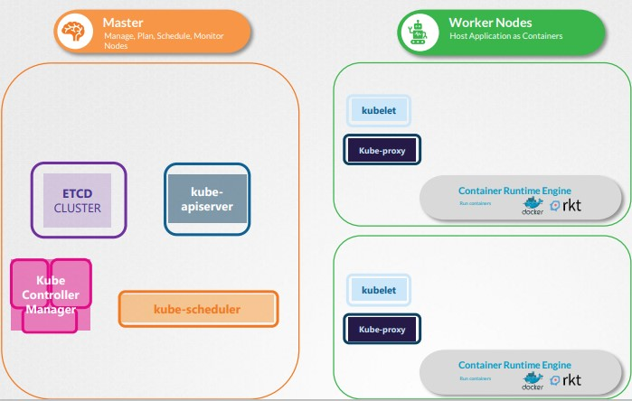
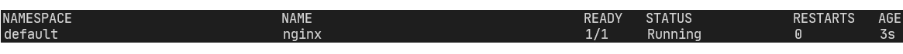
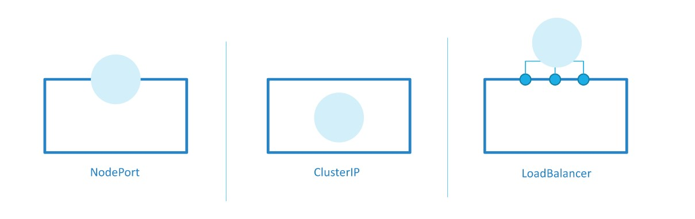
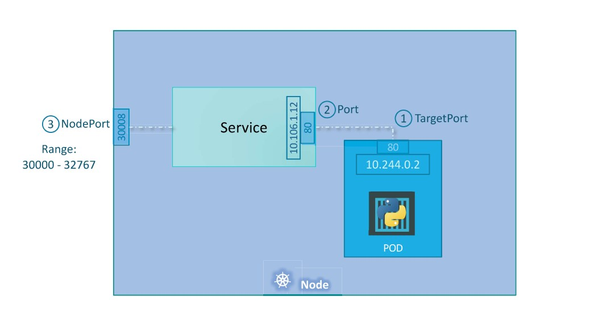
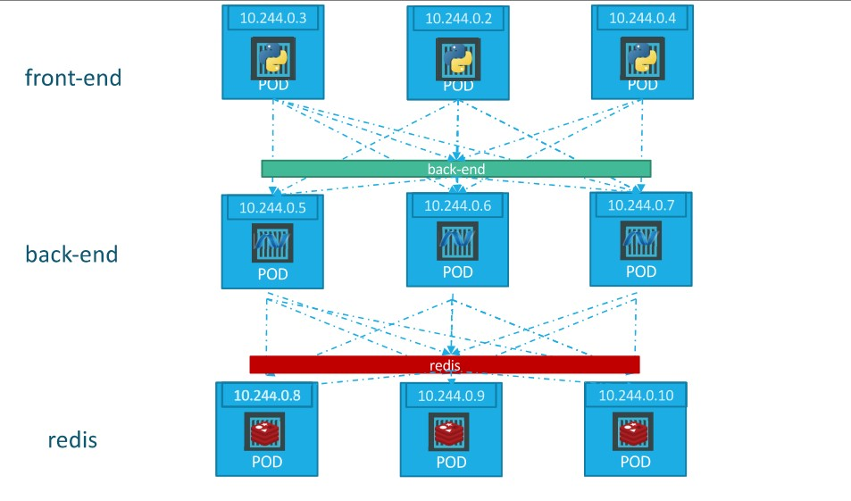

# Kubernetes architecture
The purpose of Kubernetes is to host an application in the form of a container to automatically handle application scale and more. 

Different node types:
- Worker nodes: where the applications are running.
- Control plane (master): has components necessary to schedule containers on worker nodes, monitor nodes, etc

## Control plane components
### Etcd
Key-value database maintaining information about the cluster, different nodes, containers on each node, etc.
### Kube scheduler
Schedule containers on the worker nodes based on some metrics (node load, etc.)
### Controllers
- Node controller takes care of nodes
- Replication controllers takes care the desired number of containers is running
### API server
Responsible for orchestrating all operations within the cluster.
### Container runtime engine
All in Kubernetes is in the form of containers, so there is a CRI (docker, cri-o, etc.).

## Worker components
### Kubelet
Listens for instructions from the API sever and deploys or destroys containers on the nodes. The kube-api-server also peroidically fetches updates from the kubelet to monitor status of nodes.
### Kube-proxy
Enables the communication among worker nodes to allow containers on different nodes to communicate.



# ETCD
ETCD is is a distributed reliable key-value store that is simple, secure and fast.
## Key value store
Information are stored in a key-value format. You cannot have duplicate keys. It is used to store and retrieve small chunk of data that requires to be extracted in a fast way.
Example of key-value data:
```
{
"name": "John Doe",
"age": 45,
"location": "New York",
"salary": 5000
}
```
## Operate ETCD 
ETCD can be installed as a service running on port 2379, and it can be manager through the ```etcdctl``` CLI that can be used to store and get information from the ETCD database.
ETCD can be downloaded from here ```https://github.com/etcd-io/etcd/```, and after extracting the package you can try the following:
```
./etcd #run etcd from installation
./ ```etcdctl``` set key1 value1 #store value
./ ```etcdctl``` get key1 #retrieve value
```
# ETCD in Kubernetes
ETCD stores information about nodes, PODs, Configs, Secrets, Accounts, Roles, Bindings, etc. Every information given from the API server comes from the ETCD database.
When making changes interacting with the ```kubectl``` CLI, a change is made effective only when stored on ETCD.
Depending on how the cluster is setup, ETCD can be deployed in different modalities.
We can distinguish two types of cluster setup:
- From scratch: ETCD is deployed by downloading and installing by yourself the ETCD service. In this case, the ETCD service will have the following configurations:
```
ExecStart=/usr/local/bin/etcd \\
--name ${ETCD_NAME} \\
--cert-file=/etc/etcd/kubernetes.pem \\
--key-file=/etc/etcd/kubernetes-key.pem \\
--peer-cert-file=/etc/etcd/kubernetes.pem \\
--peer-key-file=/etc/etcd/kubernetes-key.pem \\
--trusted-ca-file=/etc/etcd/ca.pem \\
--peer-trusted-ca-file=/etc/etcd/ca.pem \\
--peer-client-cert-auth \\
--client-cert-auth \\
--initial-advertise-peer-urls https://${INTERNAL_IP}:2380 \\
--listen-peer-urls https://${INTERNAL_IP}:2380 \\
--listen-client-urls https://${INTERNAL_IP}:2379,https://127.0.0.1:2379 \\
--advertise-client-urls https://${INTERNAL_IP}:2379 \\
--initial-cluster-token etcd-cluster-0 \\
--initial-cluster controller-0=https://${CONTROLLER0_IP}:2380,controller-1=https://${CONTROLLER1_IP}:2380 \\
--initial-cluster-state new \\
--data-dir=/var/lib/etcd
```
where ```--advertise-client-urls``` is the most important indicating where the ETCD service is listening, and this URL should be configured in the API server to tell it where to reach the ETCD.
- With ```kubeadm```: kubeadm will deploy ETCD server as a pod in the kube-system namespace. Entering the ETCD pod we can run commands using the  ```etcdctl``` CLI as shown in the previous chapter.
```
kubectl exec etcd-master –n kube-system  ```etcdctl``` get / --prefix –keys-only
```

## ETCD in HA environment
When deploying ETCD in an HA environment, you should pay attention to make sure all ETCD instances know each other by setting the ```--initial-cluster``` property properly.

## ETCD commands
 ```etcdctl``` is the CLI tool used to interact with ETCD.

 ```etcdctl``` can interact with ETCD Server using 2 API versions - Version 2 and Version 3.  By default its set to use Version 2. Each version has different sets of commands.

For example  ```etcdctl``` version 2 supports the following commands:

 ```
etcdctl backup
etcdctl cluster-health
etcdctl mk
etcdctl mkdir
etcdctl set
``` 

Whereas the commands are different in version 3

```
etcdctl snapshot save 
etcdctl endpoint health
etcdctl get
etcdctl put
 ```

To set the right version of API set the environment variable  **ETCDL_API** command

 ```
 export ETCDL_API=3
 ```


When API version is not set, it is assumed to be set to version 2. And version 3 commands listed above don't work. When API version is set to version 3, version 2 commands listed above don't work.

Apart from that, you must also specify path to certificate files so that  ```etcdctl``` can authenticate to the ETCD API Server. The certificate files are available in the etcd-master at the following path.
```
--cacert /etc/kubernetes/pki/etcd/ca.crt     
--cert /etc/kubernetes/pki/etcd/server.crt     
--key /etc/kubernetes/pki/etcd/server.key
```
So the final version of the command to use ```etcdl``` from the ETCDL pod is the following:
```
kubectl exec etcd-master -n kube-system -- sh -c " ETCDL_API=3  etcdctl get / --prefix --keys-only --limit=10 --cacert /etc/kubernetes/pki/etcd/ca.crt --cert /etc/kubernetes/pki/etcd/server.crt  --key /etc/kubernetes/pki/etcd/server.key" 
```

# Kube api server
It is the primary management component in Kubernetes. When using ```kubectl``` you are issuing a request to the ```kube-apiserver``` which authenticate the user, validates the request, performs an operation and answers.

For instance, when creating a new POD, you have to submit a ```POST``` request to the ```kube-apiserver``` which performs the following operations:
1. Authenticate User
2. Validate request
3. Retrieve data
4. Update ETCD
5. Then the scheduler which monitors the API server, realise there is a POD with no node assigned, so identify the node, communicate it to the API server which stores the information in the ETCD database and passes the information to the kubelet which deploys the application's POD.
Then the kubelet goes back to the ```kube-apiserver``` which updates ETCD.

## Operate Kube api server
As said for ETCD, also the ```kube-apiserver``` can be configured both from scratch or with ```kubeadm```. In the first case, you have to install it by its binary and then run it as a service on the master node.
Setting up the cluster from scratch, you can download the APi server from:
```
wget https://storage.googleapis.com/kubernetes-release/release/v1.13.0/bin/linux/amd64/kube-apiserver
```
Instead, with ```kubeadm```, the kube-apiserver is deployed as a POD in the master node. The yaml file describing ```kube-apiserver``` is at:
```
 /etc/kubernetes/manifests/kube-apiserver.yaml
 ```

 Here all the configurable options of ```kube-apiserver```:
 ```
ExecStart=/usr/local/bin/kube-apiserver \\
--advertise-address=${INTERNAL_IP} \\
--allow-privileged=true \\
--apiserver-count=3 \\
--audit-log-maxage=30 \\
--audit-log-maxbackup=3 \\
--audit-log-maxsize=100 \\
--audit-log-path=/var/log/audit.log \\
--authorization-mode=Node,RBAC \\
--bind-address=0.0.0.0 \\
--client-ca-file=/var/lib/kubernetes/ca.pem \\
--enable-admission-plugins=Initializers,NamespaceLifecycle,NodeRestriction,LimitRanger,ServiceAccount,Defa
ultStorageClass,ResourceQuota \\
--enable-swagger-ui=true \\
--etcd-cafile=/var/lib/kubernetes/ca.pem \\
--etcd-certfile=/var/lib/kubernetes/kubernetes.pem \\
--etcd-keyfile=/var/lib/kubernetes/kubernetes-key.pem \\
--etcd-servers=https://10.240.0.10:2379,https://10.240.0.11:2379,https://10.240.0.12:2379 \\
--event-ttl=1h \\
--experimental-encryption-provider-config=/var/lib/kubernetes/encryption-config.yaml
\\
--kubelet-certificate-authority=/var/lib/kubernetes/ca.pem \\
--kubelet-client-certificate=/var/lib/kubernetes/kubernetes.pem \\
```

# Kube controller manager
It manages various controllers in Kubernetes. Each controller is responsible of different topics, but each of them act by watching the status of the monitored resource and reconcile the situation to the desired state.

Some examples of Kubernetes controllers are:\
**Node controller**:
The node controller is responsible for monitoring the state of the nodes by checking their status each 5 seconds. If it stops receiving heartbeat from one node, it is marker unreachable after additional 40 seconds.
After a node is marker unreachable, it has 5 minutes to come back up. After that, all PODs are evicted from that node and moved to a live node.

**Replication controller**: It is responsible for ensuring the desired number of PODs are available within each replicaset. If a POD dies, it creates another one.

When the Kubernetes controller manager is installed, all the controllers are automatically installed, including the two explained above.

You can install the Kubernetes controller manager as a service (from scratch) here:
```
wget https://storage.googleapis.com/kubernetes-release/release/v1.13.0/bin/linux/amd64/kube-controller-manager
```
or using ```kubeadm``` as a POD in the kube-system namespace.

Here all the configurable options of Kube controller manager:
```
ExecStart=/usr/local/bin/kube-controller-manager \\
--address=0.0.0.0 \\
--cluster-cidr=10.200.0.0/16 \\
--cluster-name=kubernetes \\
--cluster-signing-cert-file=/var/lib/kubernetes/ca.pem \\
--cluster-signing-key-file=/var/lib/kubernetes/ca-key.pem \\
--kubeconfig=/var/lib/kubernetes/kube-controller-manager.kubeconfig \\
--leader-elect=true \\
--root-ca-file=/var/lib/kubernetes/ca.pem \\
--service-account-private-key-file=/var/lib/kubernetes/service-account-key.pem \\
--service-cluster-ip-range=10.32.0.0/24 \\
--use-service-account-credentials=true \\
--v=2
```

# Kube scheduler
The scheduler is responsible for deciding which POD goes on which node, without actually creating that POD: the ```kubelet``` is then responsible for creating it.
The decision is taken based on two phases:
1. The scheduler discards the nodes that do not fit the POD's requirements, for instance CPU or memory requirements.
2. The scheduler identifies the best node among the remaining to assign the POD. This is done by assigning a score to each node and choosing the one getting a better ranking.

The kube-scheduler can be installed:
1. As a service:
```
wget https://storage.googleapis.com/kubernetes-release/release/v1.13.0/bin/linux/amd64/kube-scheduler

```

2. By means of ```kubeadm``` having a POD running in the kube-system namespace. 
THe list of configurable options for the scheduler is:
```
ExecStart=/usr/local/bin/kube-scheduler \\
--config=/etc/kubernetes/config/kube-scheduler.yaml \\
--v=2
```

# Kubelet
The ```kubelet``` service is responsible for registering the node within the cluster, and waiting for instructions to load a new POD on the node.
Whenever a new POD should be scheduled, it communicates with the CRI to download the image and actually run the container.
Notice that to deploy ```kubelet ```there is just one option: installing ```kubelet``` and run it as a service on all worker nodes. ```Kubeadm``` will not install and configure it for you.

Here is how to download and see kubelet configuration options:
```
wget https://storage.googleapis.com/kubernetes-release/release/v1.13.0/bin/linux/amd64/kubelet

```
```
ExecStart=/usr/local/bin/kubelet \\
--config=/var/lib/kubelet/kubelet-config.yaml \\
--container-runtime=remote \\
--container-runtime-endpoint=unix:///var/run/containerd/containerd.sock \\
--image-pull-progress-deadline=2m \\
--kubeconfig=/var/lib/kubelet/kubeconfig \\
--network-plugin=cni \\
--register-node=true \\
--v=2
```

# Kube proxy
Within a Kubernetes cluster every POD can communicate with every other POD. This is obtained by setting up a POD network spanning multiple nodes.

```kube-proxy``` is a process running on each node, which is in charge to look for new Kubernetes services: each time a new service is created, ```kube-proxy``` creates the appropriate rule on each node to forward the traffic destined to the services to the actual backend PODs.
One way it does this is using IP tables rules. 

Again, ```kube-proxy``` can be run as a service or using ```kubeadm``` which deploys it as a ```daemonset```, making it running on each node.

Here is how to download kube-proxy as a service and the configurable options:
```
wget https://storage.googleapis.com/kubernetes-release/release/v1.13.0/bin/linux/amd64/kube-proxy
```
```
ExecStart=/usr/local/bin/kube-proxy \\
--config=/var/lib/kube-proxy/kube-proxy-config.yaml
Restart=on-failure
RestartSec=5
```

# PODs
We will start from a scenario where you have an application developed and containerized in a Docker image, and a fully-working Kubernetes cluster.\
To deploy your application into Kubernetes, you cannot directly deploy the container starting from the image, but you have to first incapsulate the container into a POD.
When the application have to be scaled, a new POD identical to the previous one is deployed on the same Kubernetes node, or in another node.\
Usually, PODs have a 1:1 relationship with an application (container), but there are cases in which more than one container can be deployed in the same POD, like _sidecar_ containers. Example of sidecar containers are container repsonsible for collecting logs from the main application's container.

You can run a simple POD with an nginx container using the following ```kubectl``` command:
```
kubectl run nginx --image nginx
```
Kubernetes will create a new POD downloading the ```nginx:latest```
image from Docker Hub, and will assign the name "nginx" to the POD. You can then view the available PODs with:
```
kubectl get pods
```

At this moment, the POD is only reachable within the cluster using its **Cluster IP**. We will then see how to deploy a Kubernetes service to make the POD reachable from outside the cluster.

Instead of using the _imperative_ way by running ```kubectl run```, we can also use the _declarative_ way by defining a YAML manifest describing the POD specification and ```POST```ing it to the Kubernetes API server by means of the ```kubectl apply``` command.
An example of a basic YAML manifest to deploy an nginx file is the following:
```
pod-definition.yaml
-------------------
apiVersion: v1
kind: Pod
metadata: 
    name: nginx-pod
    labels: 
        app: nginx
spec:
    containers:
    - name: nginx-container
      image: nginx:latest
```
Notice that, for instance, **"kind"** is a _"string"_ type, while **"metadata"** is a _"dictionary"_ type. **"containers**", on the other hand, is a _"list"_ type.

After that, just run 
```
kubectl apply -f ./pod-definition.yaml
```
to run the POD.
To get details about the POD you can use:
```
kubectl decribe pod nginx
```
```
Name:         nginx
Namespace:    default
Priority:     0
Node:         node1
Start Time:   Fri, 18 Feb 2022 15:55:50 +0100
Labels:       run=nginx
Annotations:  <none>
Status:       Running
IP:           10.244.1.75
IPs:
  IP:  10.244.1.75
Containers:
  nginx:
    Container ID:   containerd://<...>
    Image:          nginx
    Image ID:       docker.io/library/nginx@sha256:<...>
    Port:           <none>
    Host Port:      <none>
    State:          Running
      Started:      Fri, 18 Feb 2022 15:55:51 +0100
    Ready:          True
    Restart Count:  0
    Environment:    <none>
    Mounts:
      /var/run/secrets/kubernetes.io/serviceaccount from default-token-q4qfs (ro)
Conditions:
  Type              Status
  Initialized       True
  Ready             True
  ContainersReady   True
  PodScheduled      True
Volumes:
  default-token-q4qfs:
    Type:        Secret (a volume populated by a Secret)
    SecretName:  default-token-q4qfs
    Optional:    false
QoS Class:       BestEffort
Node-Selectors:  <none>
Tolerations:     node.kubernetes.io/not-ready:NoExecute op=Exists for 300s
                 node.kubernetes.io/unreachable:NoExecute op=Exists for 300s
Events:
  Type    Reason     Age   From               Message
  ----    ------     ----  ----               -------
  Normal  Scheduled  4s    default-scheduler  Successfully assigned default/nginx to node1
  Normal  Pulling    4s    kubelet            Pulling image "nginx"
  Normal  Pulled     3s    kubelet            Successfully pulled image "nginx" in 938.414773ms
  Normal  Created    3s    kubelet            Created container nginx
  Normal  Started    3s    kubelet            Started container nginx
```
To delete the POD, then run:
```
kubectl delete pod nginx
```
```
pod "nginx" deleted
```

# Repica sets
It is possible to have more than one instance of the same application POD within a Kubernetes cluster. This is done by the replication-controller which ensures the desired number of PODs for each application is always available. 
Keep in mind that the replication-controller spans across multiple nodes: the same application can have a number of pods replicas that are spread across differend kubernetes nodes.

The replication-controller is different from the replica-set: the replication-controller is the old technology replaced by the *replica-set*. They perform the same operation, but there are minor differences in terms of implementation.

To deploy a replication-controller, we can use the following yaml: 
```
replication-controller-definition.yaml
-------------------
apiVersion: v1
kind: ReplicationController
metadata: 
    name: nginx-rc
    labels: 
        app: nginx
spec:
    template:     # The template defines which PODs the replication-controller must create
        metadata: 
            name: nginx-pod
            labels: 
                app: nginx
        spec:
            containers:
            - name: nginx-container
            image: nginx:latest
    replicas: 3     # Number of PODs to create
```

Running the command:
```
kubectl get replicationcontroller
```
we can see the replication-controller in the cluster.

The replica-set, instead, is slightly different. It includes a _selector_ section where you must specify to tell the replica-set which PODs will fall under it. This is because the replica-set can also manage PODs that are not created together with the replica-set. For instance, the replica-set can manage PODs that are created before the creation of the replica-set itfself.

```
replication-controller-definition.yaml
-------------------
apiVersion: apps/v1
kind: ReplicaSet
metadata: 
    name: nginx-rs
    labels: 
        app: nginx
spec:
    template:
        metadata: 
            name: nginx-pod
            labels: 
                app: nginx
        spec:
            containers:
            - name: nginx-container
            image: nginx:latest
    replicas: 3 
    selector:
        matchLabels:
            app: nginx
```
Running the command:
```
kubectl get replicaset
```
we can see the replica-sets in the cluster.

A way to imperatively scale a replica-set is the following:
```
kubectl scale --replicas=6 replicaset nginx-rs
```

# Deployments
**Deployments** are Kubernetes objects incapsulating the replica-set object. The deployment provides us with the capability to upgrade the underlying instances seamlessly using a *rolling update* strategy, undo changes and pause and resume changes. 

The following is a YAML of a Kubernetes deployment.
```
deployment-definition.yaml
-------------------
apiVersion: apps/v1
kind: Deployment
metadata: 
    name: nginx-deploy
    labels: 
        app: nginx
spec:
    template:
        metadata: 
            name: nginx-pod
            labels: 
                app: nginx
        spec:
            containers:
            - name: nginx-container
            image: nginx:latest
    replicas: 3 
    selector:
        matchLabels:
            app: nginx
```

When creating a Kubernetes deployment, also the corresponding replicaset and PODs are created. It is possible to see all created resources at once by running:
```
kubectl get all
```

# Certification Tip!

As you might have seen already, it is a bit difficult to create and edit YAML files. Especially in the CLI. During the exam, you might find it difficult to copy and paste YAML files from browser to terminal. Using the kubectl run command can help in generating a YAML template. And sometimes, you can even get away with just the kubectl run command without having to create a YAML file at all. For example, if you were asked to create a pod or deployment with specific name and image you can simply run the kubectl run command.

Use the below set of commands to speed up resource creation.
Reference (Bookmark this page for exam. It will be very handy):
https://kubernetes.io/docs/reference/kubectl/conventions/

## Create an NGINX Pod
```
kubectl run nginx --image=nginx
```
## Generate POD Manifest YAML file (-o yaml). Don't create it(--dry-run)
```
kubectl run nginx --image=nginx --dry-run=client -o yaml
```
## Create a deployment
```
kubectl create deployment --image=nginx nginx
```
## Generate Deployment YAML file (-o yaml). Don't create it(--dry-run)
```
kubectl create deployment --image=nginx nginx --dry-run=client -o yaml
```
## Generate Deployment YAML file (-o yaml). Don't create it(--dry-run) with 4 Replicas (--replicas=4)
```
kubectl create deployment --image=nginx nginx --dry-run=client -o yaml > nginx-deployment.yaml
```
## Save it to a file, make necessary changes to the file (for example, adding more replicas) and then create the deployment.
```
kubectl create -f nginx-deployment.yaml
```
OR

**In k8s version 1.19+, we can specify the --replicas option to create a deployment with 4 replicas.**
```
kubectl create deployment --image=nginx nginx --replicas=4 --dry-run=client -o yaml > nginx-deployment.yaml
```

# Namespaces
Namespaces represent logical partitioning of a Kubernetes cluster where Kubernetes resources can be put into.
By default, Kubernetes creates three namespaces when a cluster is created:
- **default** namespace: initially empty.
- **kube-system** namespace: where all system PODs are places (etcd, kube-proxy, etc.).
- **kube-public**: where resources that should be made available for all users are created.

You can create your own namespace as well: 
```
kubectl create namespace dev
```

Each namespace can have a set of enforcements, like:
- _Policies_ to define who can do what;
- _Resource limits_ to specify the maximum amount of resources allocated to the resource in the namespace;

A given POD can reach both services in its same namespace as well as services in other namespaces:
- To connect to a POD in the same namespace, you just need to specify its name.
- To connect to a service in another namespace, you specify it with the following naming convention: _servicename.namespace.svc.cluster.local_.

You can list resources specifying the namespace:
```
kubectl get pods -n namespace
```
or to get PODS in all namespaces:
```
kubectl get pods --all-namespaces
or
kubectl get pods -A
```

You can also specify what is the default namespace using the command:
```
kubectl config set-context $(kubectl config current-context) --namespace=dev
```

To limit the amount of resources to allocate to a given namespace, you can create a **resource-quota**. 
An example is:
```
resource-quota-definition.yaml
----------------
apiVersion: v1
kind: ResourceQuota
metadata:
    name: compute-quota
    namespace: dev
spec:
    hard:
        pods: "10"
        requests.cpu: "4"
        requests.memory: 5Gi
        limits.cpu: "10"
        limits.memory: 10Gi
```

# Services
Kubernetes services enable communication between various components within and outside an application, and help connect application together and other applications to users.
There are different types of Kubernetes services:

- **Nodeport**: the service makes an internal POD accessible on a given port on each Kubernetes node.
- **ClusterIP**: the service creates a virtual IP within the cluster for internal communication.
- **LoadBalancer**: it provisions a load balancer for the Kubernetes services in supported cloud providers (Azure, Aws, GCP, etc.).

## NodePort
The **nodeport** service maps a port on the Kubernetes nodes with a port on the POD running inside the cluster.

In this scenario, we have different definitions:
- The _nodeport_ is the port of the Kubernetes node where the service can be reached. The nodeport can be in the range 30000-32767.
- The _targetport_ is the port which the service maps on the POD.
A nodeport service is defined as follows:
```
nodeport-definition.yaml
----------------
apiVersion: v1
kind: Service
metadata:
    name: nodeport-service
spec:
    type: NodePort
    ports:
    - targetPort: 80
        port: 80
        nodePort: 30008
    selector:
        app: nginx
```
The only mandatory field is port, the targetPort is automatically set to the port value, and the nodePort is automatically chosen between 30000 and 32767.
The service is connected to the application through the _selector_ specification, which in the example matches the label _app_.

Clearly, the service is not commonly used to expose a single POD, but instead to expose a whole deployment, performing automatic balance among replicas in the deployment.
The load is distributed in a random fashion using the principle of *session affinity*.

## Cluster IP
Usually an application is composed by different layers, a frontend, a backend and a data layer. PODs in different layers need to communicate with each other. To do this, they cannot use the IP assigned to the POD itself, since this IP is _ephemeral_ and will be changed each time the POD is restarted for some reasons.
Therefore, the **cluster-ip** service provides PODs (or deployments) with a stable internal IP to allow inter PODs communication.

A cluster-ip service is defined as follows:
```
cluster-ip-definition.yaml
----------------
apiVersion: v1
kind: Service
metadata:
    name: cluster-ip-service
spec:
    type: ClusterIP
    ports:
    - targetPort: 80
        port: 80
    selector:
        app: nginx
```
       
## Load balancer
If an application should be accessed by end-users, we need to provide a single entry-point to it. Nodeport service will make the application accessible using any one of the cluster nodes' IPs on the given nodeport. Therefore, the **load-balancer** service comes in by assigning a public IP to the service using a supported cloud load balancer.

A load-balancer service is defined as follows:
```
load-balancer-definition.yaml
----------------
apiVersion: v1
kind: Service
metadata:
    name: load-balancer-service
spec:
    type: LoadBalancer
    ports:
    - targetPort: 80
        port: 80
    selector:
        app: nginx
```
## Additional tips
A Kubernetes service can also be created in the imperative way using:
```
kubectl expose pod nginx --type=NodePort --port=80 --name=nginx-service
```
or to specify the service type
```
kubectl create service clusterip nginx --tcp=6379:6379 --dry-run=client -o yaml
```

Both the above commands have their own challenges. While one of it cannot accept a selector the other cannot accept a node port. I would recommend going with the kubectl expose command. If you need to specify a node port, generate a definition file using the same command and manually input the nodeport before creating the service.

# Imperative vs Declarative approaches
So far we've seen different ways of creating and managing Kubernetes resources. In the _infrastructure as code_ world there are two ways of creating resources: **imperative** and **declarative** way. 
The imperative way, consists in specifying what to do and how to do it accordingly. The declarative approach consists in specifying the final desired outcome and the system will figure out what to do to reach the desired result.

In the imperative approach, we declare step-by-step what to do:
```
1. Provision a VM by the name 'web-server'.
2. Install NGINX software on it.
3. Edit configuration file to use port '8080'
```
In the declarative way, we specify the outcome:
```
VM Name: web-server
Package: nginx
Port: 8080
```

In the Kubernetes world, the imperative way is implemented by using kubectl commands. 
For instance:
```
kubectl run --image=nginx nginx
```
The declarative approach, is instead implemented using YAML manifest files.
For instance:
```
nginx-pod.yaml
---------------
apiVersion: v1
kind: Pod
metadata:
  labels:
    run: nginx
  name: nginx
spec:
  containers:
  - image: nginx
    name: nginx
  dnsPolicy: ClusterFirst
  restartPolicy: Always
```
The suggested way to do things is using the declarative approach, to keep track of what has been done and implement idempotent configurations.
In the exam, however, the imperative way is very useful to speed up commands execution.

# Kubectl Apply
The Kubectl Apply command can be used to create or update Kubernetes objects starting from a yaml configuration file. When applying a Kubernetes manifests, there are two possibilities of how Kubernetes actually manages it:
1. If the object does not exists, Kubernetes creates the object starting from the YAML.
2. If the object already exists, Kubernetes compare the new manifest with the _last applied configuration_, which is a json version of the last applied yaml file, and applies the changes in an _incremental_ way.
Notice that the _last applied configuration_ is stored within the Kubernetes yaml file created from Kubernetes as an **annotation** in the kubectl.kubernetes.io/last-applied-configuration key.
An example is the following:
```
nginx-deployment.yaml
---------------
apiVersion: apps/v1
kind: Deployment
metadata:
  annotations:
    # ...
    kubectl.kubernetes.io/last-applied-configuration: |
      {"apiVersion":"apps/v1","kind":"Deployment",
      "metadata":{"annotations":{},"name":"nginx-deployment","namespace":"default"},
      "spec":{"selector":{"matchLabels":{"app":nginx}},"template":{"metadata":{"labels":{"app":"nginx"}},
      "spec":{"containers":[{"image":"nginx:1.16.1","name":"nginx",
      "ports":[{"containerPort":80}]}]}}}}      
    # ...
spec:
  selector:
    matchLabels:
      # ...
      app: nginx
  replicas: 2 # Set by `kubectl scale`.  Ignored by `kubectl apply`.
  # minReadySeconds cleared by `kubectl apply`
  # ...
  template:
    metadata:
      # ...
      labels:
        app: nginx
    spec:
      containers:
      - image: nginx:1.16.1 # Set by `kubectl apply`
        # ...
        name: nginx
        ports:
        - containerPort: 80
        # ...
      # ...
    # ...
  # ...
```

