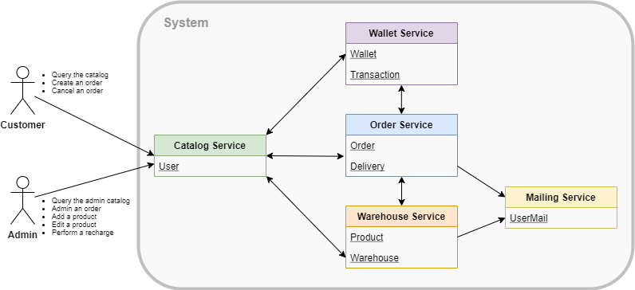
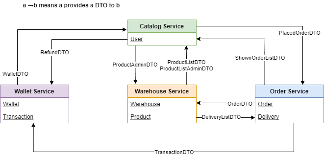
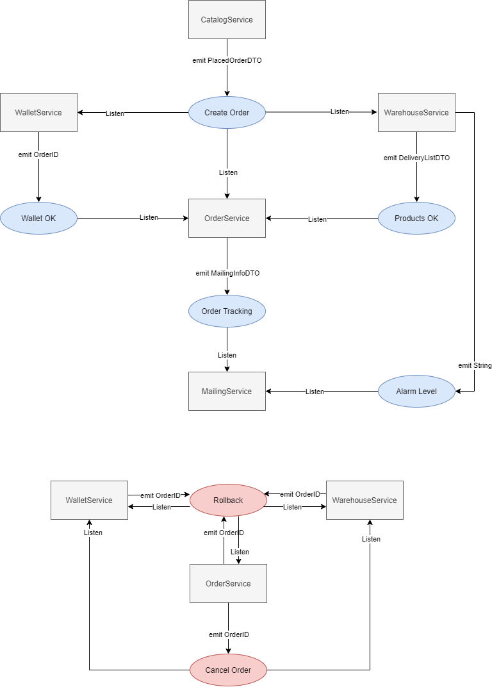

# Overview

The goal of the [presented project](https://github.com/franckies/ecommerce-api) is to build a RESTful
API for an eCommerce system exploiting the Spring Boot
framework and based on the novel paradigm of distributed
microservices.
This architecture allows flexibility in deploying each basic
component (i.e.μS) in a different location, either a physical
server or a cloud-hosted virtual machine. This advantage
comes at the cost of an error-prone (network) communication among each infrastructural node, while the traditional
monolithicapproach is more straightforward in terms of
communication (i.e. simple method invocation or IPC).

# Architecture
The web application is composed of the following microservices:

-   CatalogService: customers and admins interact only
    with thisμS that forwards the requests to the internal
    facilities;
-   OrderService: responsible for handling the order workflow and confirming it when all the conditions are
    satisfied (i.e. money and products availability);
-   WalletService: handles the information about customers’
    money and transactions;
-   WarehouseService: handles the products in any warehouse and it is in charge of picking up the items;
-   MailingService: handles the mailing information for
    updating customers and admins about the orders.

This figure explains the data responsibility (i.e. which piece of
information is held in eachμS) and the interactions among
the components.

# Functional Requirements

All the functional requirements and their high-level implementation are depicted in the above picture. Three actors can be defined:

-   Anonymous reader: represents a non-authenticated
    user, which canquery the catalog(1) and retrieve a
    list of all the available products together with their price,
    quantity, description, picture, and category. Technically,
    this is done through a GET request on the specific endpoint exposed by the CatalogService, which in turn performs a GET request on an endpoint exposed by the WarehouseService, which is in charge of storing products’ information.

-   Customer: represents an authenticated customer, extending the requirements already available for an anonymous reader. A customer can login(2) using his own
    credentials. A convenient way to handle the authentication mechanism is to store in-memory users. He can
    submit a request tocreate an order(3). This operation comes in two different flavours:synchronousand
    asynchronous. In both cases, two main controls have
    to be performed before confirming the order: checking
    if the user has enough money in his wallet and if
    there are enough products. When the order is confirmed,
    the customer receives the order identifier, which can
    also be used toquery the customer’s orders (4) at
    any time through a specific endpoint exposed by the
    CatalogService. Notice that when the order is displayed
    to the customer, it will be split into as many parts as
    the number of deliveries associated with it. Each part of
    the order will have its own status, giving the user more
    fine-grained control over the tracking. If an order has
    been confirmed but not yet shipped, the customer can
    decide todelete the order(5). Similar to what is said
    for the order creation, also the order cancellation can be
    performed synchronously or asynchronously. Whenever
    an order is confirmed, failed, or deleted, the customer
    will receive an email notifying the event. In the end,
    a customer can query his own wallet (6), to verify
    the remaining amount of money and all the performed
    transactions.
-   Admin: represents a user authenticated as a system
    administrator, extending the requirements already available for an anonymous reader. As for the customer,
    the admin can login (7) exploiting the same in-
    memory user management system. An admin can also
    query the admin catalog(8), which contains more detailed information about where each product is stored
    (i.e. in which warehouse), and the alarm levelof a
    given product, indicating when the stock is running
    out of a product; when a threshold is exceeded, an
    email is sent to the admin notifying the event. Admins
    can alsoedit a product(9), edit an order(10) and
    recharge the wallet of an user(11).
A detailed view of all the exposed endpoints of eachμS is
accessible in the documentation of the repository.

# Distributed transactions
The main drawback of the microservice architecture is the
difficulties encountered in handlingdistributed transactions.
Those are sequence of operations that can be either all
correct (i.e. commit) or just a single failure requires to
restore the previous situation (i.e.rollback). The Use Case 3,
described above, is an example of distributed transaction
because it involves several DB updates, such as money
withdrawal, products reservation, and shipping tracking. All
those information has to be coherent along all the involved
MongoDB collections, even though they are handled by
differentμSs.
One way to implement distributed transactions across
multiple μSs is offered by the SAGA paradigm. If an
operation within a given transaction fails, the SAGA relies
on the notion ofcompensating transactions, which means
each local operation must be able to be reverted running
another action.
The SAGA object is created by CatalogService and
composed of an ID, that is a unique identifier representing
the order, the user ID, and a purchase list (map of product,
quantity, and price). EachμS implements a local operational
logger that contains all the information needed in case of
rollback. The SAGA paradigm has been implemented in
both the orchestrator and choreography flavors.
### A. Synchronous orchestration
In the synchronous implementation of the order creation
SAGA, the communication between the services is implemented with REST API. The CatalogService starts the order
SAGA, delegating the role of the synchronous orchestrator to
the OrderService, which is in charge of sequentially requesting operations to the WalletService and WarehouseService.
In the above figure is shown a high-level representation of how the
μSs communicate with each other. After receiving an order
request (1), the OrderService requests the WalletService to
perform a transaction (2) on the user’s wallet and lock the
money; if the operation is successful (3), it queries the
WarehouseService (4) to provide the list of deliveries to
be shipped (5) and then it commits the transaction on the
WalletService (6). The OrderService then sends a confirmation mail to the user (7), returns the order, and starts the
deliveries (8). If any of these operations fail, the OrderService
sends a rollback request providing the SAGA ID to the
WalletService and WarehouseService, returning also an error
to the CatalogService.
In this implementation OrderService is a single point of
failuresince both the commit and rollback operations are
completely handled by this service.

### B. Asynchronous choreography
On the other hand, in the asynchronous implementation
of the order creation SAGA, the communication between
the services is implemented throughKafka. This technology
implements a publishsubscribe patternand it involves a
centralbrokerable to notify all the interestedμSs.
This even-based communication style enforces an asynchronous paradigm in which every event is triggered by a
μS and every other entity knows how to react properly.
The pictures shows how the SAGA is initialized by the CatalogService (who creates its unique ID) and it is notified
on thecreate_ordertopic. All the interested services
react to this request by predisposing the order (i.e. OrderService) or by checking internal availability (i.e. WalletService and WarehouseService). The latter entities notify the
correct execution of the withdrawal (onwallet_okand
products_oktopics respectively) or rollback the entire
transaction. In this scenario, the OrderService has only the
responsibility of committing the transaction when all three
conditions are satisfied and properly communicated on their
specific topics. Beware that this highly parallelized solution
increases the speed of the creation, but does not provide any
guarantees on the sequentiality of the events. An alternative solution would be letting the OrderService starting the
SAGA, gaining in a stricter order of arrival, but falling back
to an orchestrator-like role (with all the previously presented
issues).
Therollbacktopic is relevant for all the three services
actively involved in the transaction. The content of this event
is the ID of the SAGA to dismiss. Thanks to the internal
operational logging, each μS is capable of restoring the
previous status (i.e. undo the operation) without needing any
further information.
The explicit deletion of an order from a customer is overlapping, at a practical level, with the rollback operation (i.e.
all the money and products have to be restored), but it is
semantically different and requires an initial check on the
actual existence of the specified order. For this reason, in
this situation, the workflow is forced to synchronously reach
the OrderService (owning the order data) which has the
responsibility to emit on thecancel_ordertopic.
All the Kafka listeners have been implemented idempotent
through a log database: all the operations are recorded so
that if a request arrives multiple times it is executed only
once. This avoids problems in presence of eventual duplicate
messages.
It is possible to notice that in the choreography there is a
wide degree of freedom; an event is notified and then each
interested listener has to react properly according to its own
internal rules. There is no central command room, but a clear
and balanced separation of responsibilities.

# Constraints
### A. Service fails

The proposed solution ensures the proper functioning of
the system even in presence of crashes of the services
while performing the operation. This behavior is obtained
applying the write ahead logging technique: any change in
the database is preceded by storing a record of the performed
action. In case of failures, the services check their logs at the
restart and they perform aconsistency check(e.g. performing
a rollback if there are pending operations).

### B. Logic fails

In order to prevent logic fails, some considerations have
been done when designing the application. First, the local
database of each microservice is locked when performing the
local operations. Notice that this is different from a global
lock during the whole order placing transaction, which would
be not efficient at all. In this way, if two customers try to
order the same last product in stock, only one will succeed.
The assumption behind this strategy is that each microservice
has its own instance of the database.
Moreover, a unique SAGA has been associated with each
order: by doing so, we avoid conflicts within orders from
the same user (e.g. if a customer places two orders without
enough funds for the second, only the first one succeeds).

# Security infrastructure and authentication

The application is enriched with security mechanisms
using the Spring Security framework.
The exposed CatalogService checks the permissions on all
the operations (except for the request of the available products that can be done also by anonymous readers). On the
other hand, all the other internal microservices are assumed
to be trusted and all of their operations are done without
authentication.
The Spring in-memory authentication is implemented, internally storing and validating users’ credentials (i.e. username
and password).
The users can have two roles, ADMIN and CUSTOMER: the
former is allowed to do any operation, while the latter can
only perform only a subset of them.

# Deployment

In order to provide a real-case scenario, we envelop our
entire web application inside a docker-compose (each image
stored on Docker Hub) for being easily deployed in every
virtualization environment. Each microservice is compiled in
a JAR file and inserted in a docker image (together with
its configuration file). The overall compose structure also
contains the MongoDB and Kafka dockers, specifying an
internal network and enforcing the proper booting order.

# The team
This project was carried out for the Advanced Programming course by Biondo Andrea, Chiapello Nicolò, Martone Raffaele, Semeraro Francesco.

