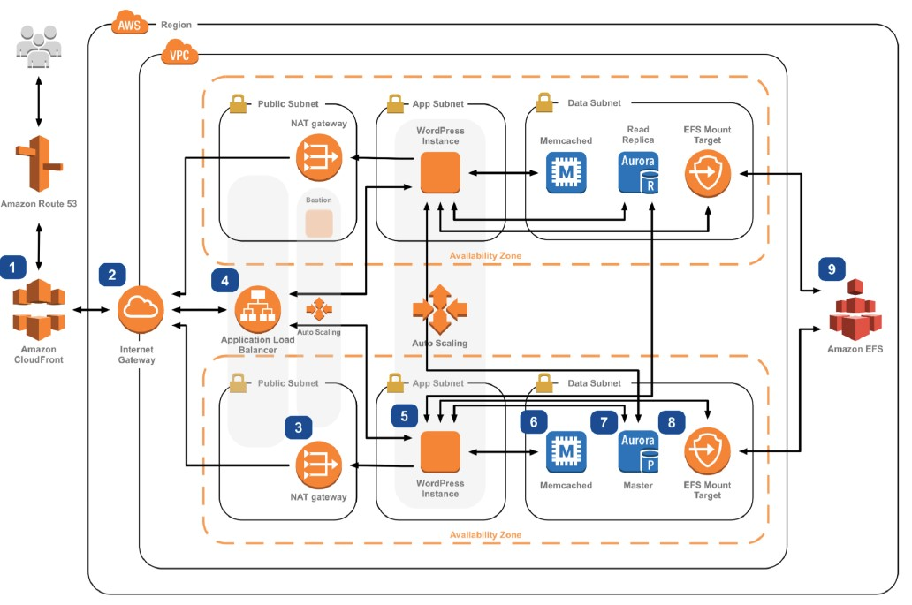

# Overview
[This project](https://github.com/franckies/HAWordpress-AWS) aims at building an high available wordpress web application hosted in AWS using Terraform. The infrastracture schema is represented in this picture (Amazon CloudFront and Route 53 will not be considered):

## Components
To create this scalable, HA web application we will use various AWS services, here divided into _terraform modules_:
### Networking
The networking module is based on the [vpc module](https://registry.terraform.io/modules/terraform-aws-modules/vpc/aws/latest), which with few lines of code builds up a VPC, configures subnets, the internet gateway and route tables.
### Data
The data module builds the following components:
- RDS Aurora Cluster with two instances, one per availability zone.
- EFS file system, which contains the wordpress code and is mounted on all the web servers of the autoscaling group.
- ElastiCache memcached.
### Application
The application module builds the following components:
- An application load balancer.
- A launch configuration which installs apache, php and wordpress on Amazon Linux 2 machines.
- An autoscaling group.
- A bastion server to reach out the VMs within the autoscaling group.

## Credits
The repo takes inspiration from this [AWS workshop](https://ha-webapp.workshop.aws/introduction/overview.html) which deploys the same infrastructure using the AWS console.
