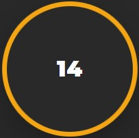

# Overview
The following project consists of the implementation of a 3-tier web application infrastructure on two different cloud service providers (CSPs), Aws and Azure. The objective is to highlight similarities and differences between the two CSPs in terms of offered services, performances, and easiness of deployment. Moreover, it will be pointed out to what extent terraform can be considered a _cloud agnostic tool_ observing the differences in the code written for the two CSPs. 
Then, the power of Terraform will be fully exploited by combining together the two infrastructures: using *Azure Traffic Manager*, a single entry point for the application will be provided, and the incoming traffic will be redirected to the Azure and Aws infrastructures in a round-robin fashion using  the DNS-based traffic load balancer approach.

# IaC with Terraform
Nowadays, the de-facto standard for IaC is Terraform which integrates with virtually all the available cloud providers and features a highly specialized domain-specific language called HCL. Terraform is a great tool with a very large community and a lot of open-source modules readily usable in the Terraform Registry.
It is developed by HashiCorp and written in GO language. It is one of the most popular Infrastructure-as-code (IaC) tools, used by DevOps teams to automate infrastructure tasks. It is used to automate the provisioning of your cloud resources.
Terraform allows you to safely provision and manage multi-cloud infrastructure at the scale. It is used to write, plan, and create Infrastructure as Code. Since this is codified it enables operators to automate infrastructure creation and changes. The configuration can be stored in version control systems and collaborated on by teams of operators. This provides more consistency, reduces errors, and decreases time.
Terraform allows us to declare configuration files that can be shared amongst team members, treated as code, edited, reviewed, and versioned. Using Infrastructure as Code, we can consistently provision your infrastructure. 

# The infrastructure
Terraform is not a configuration management tool, but for simple scenarios it can be used also to provision an application deploying it on top of the infrastructure. In this case, being the presented application a simple web application, the deploy has been done:
- For the frontend part, exploiting the possibility of the CSP to provision a bootstrap script to the frontend VMs cluster, in which our web application frontend is cloned by github and installed together with Apache2.
- For the backend part, the serverless function code is zipped and deployed to the function directly using terraform functionalities.

The web application simply consists of a fancy button, colored in blue for Azure and in orange for Aws, which displays a counter that is incremented each time the button is pressed. Behind the hood, the frontend javascript executes REST calls to the backend serverless function, which is in charge of actually increasing the counter value and storing it into a managed database. 



A simple _use case_ diagram for the application can be found below.



# The application
Terraform is not a configuration management tool, but for simple scenarios it can be used also to provision an application deploying it on top of the infrastructure. In this case, being the presented application a simple web application, the deploy has been done:
- For the frontend part, exploiting the possibility of the CSP to provision a bootstrap script to the frontend VMs cluster, in which our web application frontend is cloned by github and installed together with Apache2.
- For the backend part, the serverless function code is zipped and deployed to the function directly using terraform functionalities.

The web application simply consists of a fancy button, colored in blue for Azure and in orange for Aws, which displays a counter that is incremented each time the button is pressed. Behind the hood, the frontend javascript executes REST calls to the backend serverless function, which is in charge of actually increasing the counter value and storing it into a managed database. 

# Project structure
```bash
├── aws
│   ├── main.tf
│   ├── modules
│   │   ├── backend
│   │   │   ├── api-gateway.tf
│   │   │   ├── backend-app
│   │   │   │   └─ ...
│   │   │   ├── backend-app.zip
│   │   │   ├── backend-out.tf
│   │   │   ├── backend-vars.tf
│   │   │   └── lambda.tf
│   │   ├── data
│   │   │   ├── data-out.tf
│   │   │   ├── data-vars.tf
│   │   │   └── dynamo-db.tf
│   │   ├── frontend
│   │   │   ├── autoscaling-group.tf
│   │   │   ├── bastion.tf
│   │   │   ├── external-lb.tf
│   │   │   ├── frontend-app
│   │   │   │   └─ ...
│   │   │   ├── frontend-out.tf
│   │   │   ├── frontend-vars.tf
│   │   │   └── user-data.sh.tpl
│   │   └── networking
│   │       ├── networking-out.tf
│   │       ├── networking-vars.tf
│   │       └── vpc.tf
│   └── variables.tf
├── azure
│   ├── main.tf
│   ├── modules
│   │   ├── backend
│   │   │   ├── api-management.tf
│   │   │   ├── backend-app
│   │   │   │   └─ ...
│   │   │   ├── backend-app.zip
│   │   │   ├── backend-out.tf
│   │   │   ├── backend-vars.tf
│   │   │   └── function-app.tf
│   │   ├── data
│   │   │   ├── cosmo-db.tf
│   │   │   ├── data-out.tf
│   │   │   └── data-vars.tf
│   │   ├── frontend
│   │   │   ├── bastion.tf
│   │   │   ├── external-lb.tf
│   │   │   ├── frontend-app
│   │   │   │   └─ ...
│   │   │   ├── frontend-out.tf
│   │   │   ├── frontend-vars.tf
│   │   │   ├── scale-set.tf
│   │   │   └── user-data.sh.tpl
│   │   └── networking
│   │       ├── networking-out.tf
│   │       ├── networking-vars.tf
│   │       └── vnet.tf
│   └── variables.tf
├── images
│   └─ ...
├── main.tf
├── terraform.tfvars
└── variables.tf
```
# AWS
In this section, the services used in the AWS infrastructure will be presented.
### Networking
For what concerns the networking part, the following components have been used:
- Amazon *VPC* for the private network hosting the majority of the infrastructure's components.
- 2 public subnets, one for availability zone, hosting the bastion servers, and the application load balancer.
- 2 private subnets, one for availability zone, hosting the frontend servers. 
- 2 intra subnets, one per availability zone, to which the backend lambda function is connected. Connecting the lambda function to a VPC subnet allows the traffic from the lambda to the data layer to stay in the Amazon network without going to the internet.
- The frontend servers are behind NAT gateways which forward the traffic to an Internet Gateway, in charge of allowing the communication between the public subnet within the VPC and the internet.
- A *VPC gateway*, needed to enable private communication among the backend lambda function and the database. A VPC gateway allows traffic between the VPC and the database to not leave the Amazon network.

All components within the virtual private cloud have been configured with *security groups* to firewall inbound and outbount requests and protect them from be publicly reachable.
### Frontend Layer
The frontend layer is composed by an autoscaling group that spans two availability zones. Traffic is routed to the VMs within the autoscaling group by an application load balancer. 
To access the frontend servers, a bastion server deployed within another autoscaling group is used.
To access the VMs you can use the bastion as jump with ssh:
```
ssh -i "<path-to-your-private-key>" ec2-user@<frontend-server-private-ip> -J ubuntu@<bastion-public-ip>
```
Keep in mind that the private key is automatically generated by *key_pair module*. You can find your private key in the terraform state file after you deploy the infrastructure.
### Backend Layer
The backend layer is composed by two components:
- The API Gateway, which exposes one REST endpoint reachable with a GET or a POST request. The API Gateway endpoint is publicly accessible, and is called by the frontend servers to interact with the data layer.
- A lambda function, which is in charge of implementing the application logic, i.e. incrementing the counter each time the button in the frontend page is pressed. The lambda function is called each time a GET or POST request is performed on the API Gateway endpoint. 
### Data layer
The data layer simply consists of a DynamoDB table, storing the value of the counter. The value of the counter can be read and written only by the lambda function, which has the necessary role and policies.



# Azure
In this section, the services used in the Azure infrastructure will be presented.
### Networking
For the network infrastructure the following components have been deployed:
- A *virtual network*, for the private address space.

Unlike AWS, in azure the subnet is not a *zonal service*, therefore you cannot specify to deploy a subnet in a specific zone. Instead, the services that will be deployed within the subnet can have the *zonal parameter*, to distribute the instances of that specific service across different availability zones. For this reason, we have:
- 1 public subnet, hosting the bastion server. Notice that in Azure we're using a public load balancer, which unlike AWS cannot be placed in a subnet.
- 1 private subnet, hosting the frontend servers in the scale set, which are distributed across two different availability zones. 
- 1 intra subnet, within which the function app will be integrated to be secured.
- 2 public IPs, one for the bastion host and one for the load balancer to expose them for the communication with internet.

All components within the virtual network have been configured with *network security groups* to firewall inbound and outbount requests and protect them from be publicly reachable.
### Frontend Layer
The frontend layer is composed by a scale set that spans two availability zones. Traffic is routed to the VMs within the autoscaling group by a load balancer. 
To access the frontend servers, a bastion server is used. You can use the bastion server as jump to reach out the frontend servers using ssh:
```
ssh -i "<path-to-your-private-key>" azureuser@<frontend-server-private-ip> -J azureuser@counter-app-ssh.<your-region>.cloudapp.azure.com
```
Notice that unlike on AWS, here we've set a DNS name for the bastion host. Moreover, the private key isn't automatically generated: it is possible to specify the path where your private key is located in terraform variables file.
### Backend Layer
The backend layer is composed by two components:
- The *API Management service*, which exposes one REST endpoint reachable with a GET or a POST request. The API Gateway endpoint is publicly accessible, and is called by the frontend servers to interact with the data layer.
- An *Azure function app*, which is in charge of implementing the application logic, i.e. incrementing the counter each time the button in the frontend page is pressed. The function is called each time a GET or POST request is performed on the API Management endpoint. 
The function is written in javascript and has been configured using *output and input bindings* to communicate with data layer. 
Moreover, the function code is automatically deployed using terraform, by pushing it in a _blob container storage_ which is specified as the source from which the function app will fetch the code. 
It is worth it to specify that the azure function isn't publicly accessible, but can only be called through the endpoint exposed by the API management service. This has been implemented using *Azure AD authentication* to secure the azure function code. Locking down the azure function behind an API management service is useful for both ehnance the application security and for take advantage from the api management, which for instance allows you to ensure clients meet the quota requirements before a request is forwarded to the function. The image below taken from [this article](https://www.maxivanov.io/restrict-azure-functions-to-api-management-with-terraform/) clarifies how the authentication between the APIM and the Function APP works.



Moreover, the app service plan supporting the function app is deployed with the _Premium_ sku tier, in order to allow the function app to be integrated within the Azure VNet.
### Data layer
The data layer consists of a CosmosDB table, storing the value of the counter. The value of the counter is read and written by the function app, which interacts with the database through two [bindings](https://docs.microsoft.com/en-us/azure/azure-functions/functions-triggers-bindings?tabs=csharp):
- The first one is an *input binding*, so that each time the function is triggered by an http request a query is executed on the database and the counter's value is retrieved.
- The second one is an *output binding*, so that when a body containing a valid counter is passed to the http request the functiona app writes the counter value to the database.

The cosmos database is included within the azure VNet thorugh a _service endpoint_, and it is secured by including a firewall rule that only allow access from the intra subnet containing the function app.



# Multicloud
The multicloud infrastructure consists in deploying both the azure and the aws infrastructures, letting them communicate through REST calls respectively to the API management service and to the API gateway.
The multicloud infrastructure is depicted in the below image:



*Azure Traffic Manager* is a DNS-based traffic load balancer, which has been configured to redirect the incoming traffic to both the Azure and Aws infrastructures in a round-robin fashion. In this way our infrastructure can be consider highly available and fault-resilient, being the application deployed on two different cloud providers and split into different availability zones for each provider. In order to provide database synchronization, each time the counter value in the database of a given CSP is updated, a POST request is performed to the API of the other CSP keeping the counter value consistent across databases.
Traffic manager also provides health monitoring for each endpoint, ensuring that in case of failure all the traffic is only redirected to the healthy endpoint.
Browsing the traffic manager dns name entrypoint, you should be able to  see that for each session Traffic manager redirects you on a different endpoint, either Aws (orange press-button) or Azure (blue press-button).
Aws button interface          |  Azure button interface
:-------------------------:|:-------------------------:
  |  


